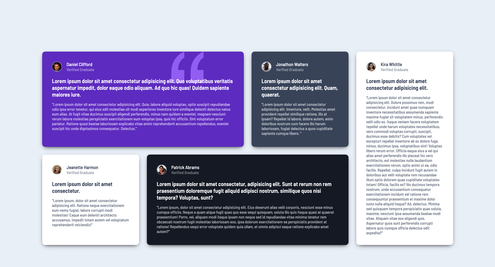
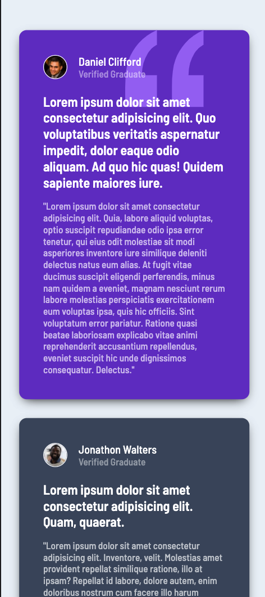

# Frontend Mentor - Testimonials grid section solution

This is a solution to the [Testimonials grid section challenge on Frontend Mentor](https://www.frontendmentor.io/challenges/testimonials-grid-section-Nnw6J7Un7). Frontend Mentor challenges help you improve your coding skills by building realistic projects. 

## Table of contents

- [Overview](#overview)
  - [The challenge](#the-challenge)
  - [Screenshot](#screenshot)
  - [Links](#links)
- My process
  - [Built with](#built-with)
  - [What I learned](#what-i-learned)
  - [Continued development](#continued-development)
- [Author](#author)

## Overview

This project involved using CSS Grid to position the comments properly.

### The challenge

Users should be able to:

- View the optimal layout for the site depending on their device's screen size

### Screenshot

### Links

- Solution URL: [Add solution URL here](https://your-solution-url.com)
- Live Site URL: [Add live site URL here](https://your-live-site-url.com)

### Built with

- Semantic HTML5 markup
- CSS custom properties
- Flexbox
- CSS Grid

### What I learned

This project was a huge learning curve for me. I learned a lot about CSS Grid and I feel much more comfortable working with it.

### Continued development

In future projects, I would love to experiment with wrapping grids and making my displays responsive to how it looks. This means having the text size change proportionally to the screen size. 

## Author

- LinkedIn - [Aman Zaveri](https://www.linkedin.com/in/aman-zaveri-23a5501b6/)
- Frontend Mentor - [@Aman-Zaveri](https://www.frontendmentor.io/profile/Aman-Zaveri)

